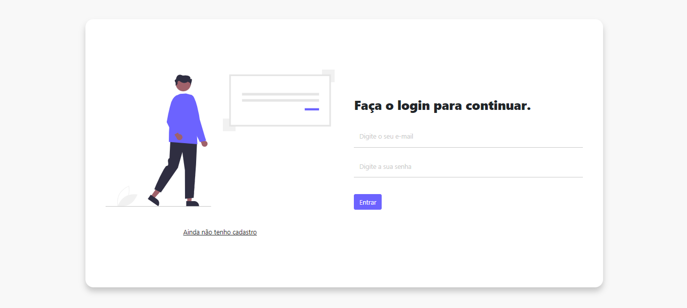
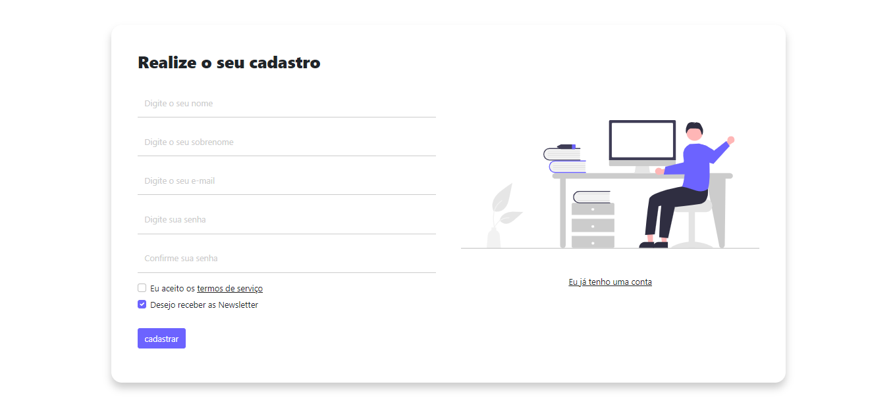

# Tela de Login e Registro

## Sobre o projeto.
Apresenta duas telas uma cadastro e outra de login. Totalmente responsivo para dispositivos móveis e com campos de checkbox para termos de serviço e recebimento de e-mail marketing.

Data de conclusão: 10/12/2021

## Ferramentas e tecnologias usadas nesse projeto.
 
```js
function LoginRegister(Project) {
    if (Front End) {
        const Stack = `${HTML}, ${CSS}`;
    } else (Framework) {
        const Stack = `${Bootstrap}`;
    }
};
```
<br>

<div align="center">




</div>

---

> - Autores: 
>   - [Eduardo Kayke](https://github.com/EduardoKayke "Perfil do Eduardo")

- [Voltar ao perfil do Github.](https://github.com/EduardoKayke "Perfil do Eduardo")

_Um dia seremos a tecnologia. Biohacking a própria evolução de nós mesmos._
